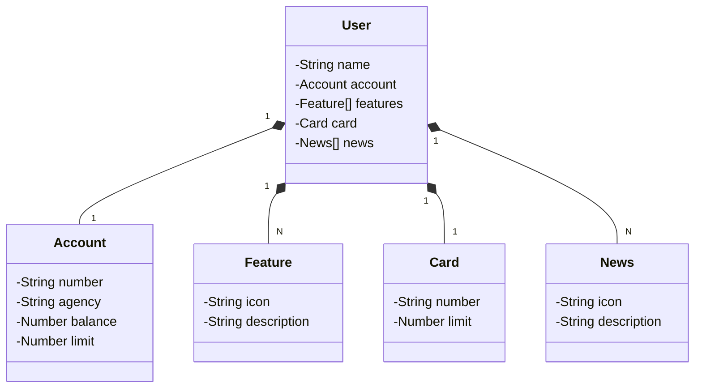

JAVA API (projeto de estudos)

## Principais Tecnologias
 - Java 22;
 - Spring Boot 3;
 - Spring Data JPA;
 - OpenAPI;
 - Railway;
 - Participação do ChatGPT

## Diagrama de Classes (Domínio da API)

